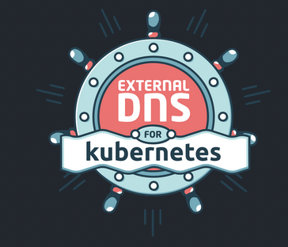

# JITSU helm chart

## For google k8s service

This chart assumes:
- a GKE cluster with workload identity enabled on cluster
- GCP service account annotated with the name of jitsu KSA 
  - To give jitsu access to GCS
  - refer to terraform directory for all needed entities 

Dependencies:
- Redis connection string 
- This chart assumes [prometheus operator](https://github.com/bitnami/charts/tree/master/bitnami/kube-prometheus/#installing-the-chart) is installed on the cluster 
  - disable monitoring in values file if not
- [External DNS](https://github.com/kubernetes-sigs/external-dns) is installed in the cluster
  - if not chart will still work

 

This chart creates a [ManagedCertificate](https://cloud.google.com/kubernetes-engine/docs/how-to/managed-certs) 
- a GKE resource that will provision a TLS certificate
- assigns this certificate to an Ingress
  - ( this will open jitsu server to the world - assuming google hosted zone is connected to a public dns)
  
Jitsu configurator is created as a ClusterIp service and can be accessed only via private IP/port forwarding

---
## terraform

`terraform` directory contains all relevant resources needed for this deployment to operate
- GCP service account
  - workload identity mapping
- reserved static ip
- ingress dns record set ( assuming google hosted zones are connected to a public dns )
- maxmind GCS bucket
  - granting jitsu SA Object Admin role on maxmind bucket

### Best install this chart using [argocd](https://argo-cd.readthedocs.io/en/stable/)

With slight modifications this chart can be installed on any k8s.
But without the GKE good stuff
( ManagedCertificate && WorkloadIdentity )
